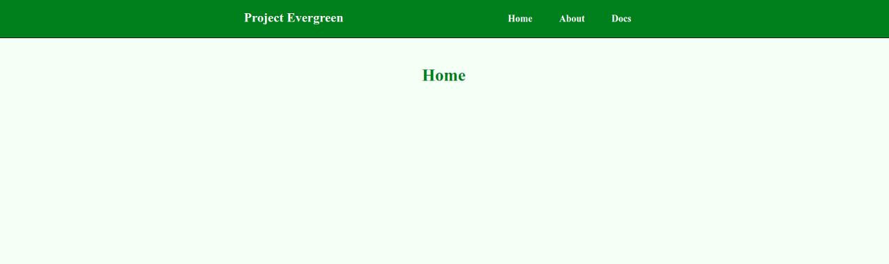

# evergreen-router-example

## Overview

An example demonstrating basic usage of [lit-redux-router](https://github.com/fernandopasik/lit-redux-router) in project evergreen.



## Development

Tasks to get you going working on this project:

- `yarn build` - build the app for production
- `yarn develop` - develop locally with live reload
- `yarn serve` - build the app and serve it locally (good for quick demos / debugging)

## Basic Example

Install following dependencies:

```
yarn add lit-redux-router lit-html @polymer/lit-element pwa-helpers redux
```

app.js

```js
import { LitElement, html } from '@polymer/lit-element';
import { connectRouter } from 'lit-redux-router';
import store from './store.js';

connectRouter(store);

export default class MyApp extends LitElement {
  render() {
    return html`
      <div class="app-bar">Example App</div>

      <div class="app-content">
        <lit-route path="/"><h1>Home</h1></lit-route>
        <lit-route path="/products/:id?/:name?" component="my-product"></lit-route>
      </div>
    `;
  }
}
```

store.js

```js
import { createStore, compose as origCompose, combineReducers } from 'redux';
import { lazyReducerEnhancer } from 'pwa-helpers/lazy-reducer-enhancer.js';

// eslint-disable-next-line no-underscore-dangle
const compose = window.__REDUX_DEVTOOLS_EXTENSION_COMPOSE__ || origCompose;

// eslint-disable-next-line
const store = createStore(
  (state, action) => state, // eslint-disable-line
  compose(lazyReducerEnhancer(combineReducers))
);

export default store;
```
