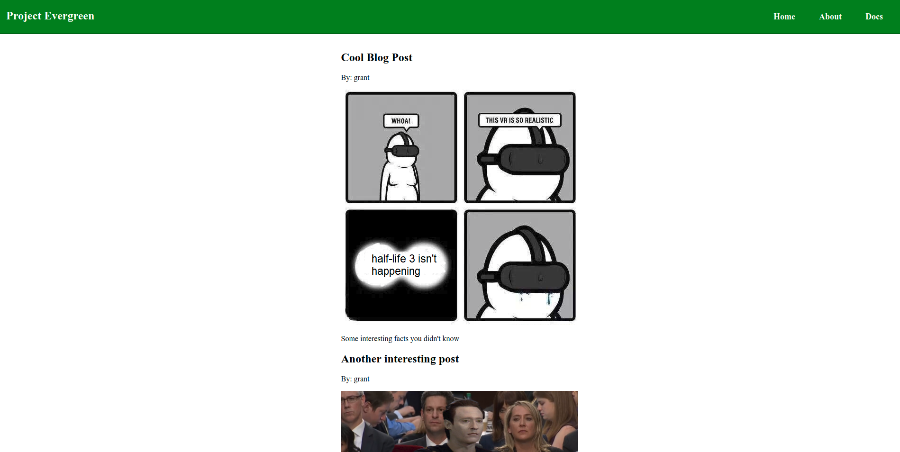

# Create Blog With Evergeen and Strapi, Headless CMS Example

- Requires Mongo already installed

## Overview



### Install Global Dependencies

```bash
npm install -g create-evergreen-app strapi
```

### Setup Project Directory

```bash
mkdir blog
cd blog
```

## Strapi

### Create New Strapi API

```bash
strapi new api
```

Follow prompt for Mongo Configuration. Enter DB Name, IP, User, Password, etc.

```bash
? Choose your main database: MongoDB
? Database name: blog-api
? Host: 127.0.0.1
? +srv connection: false
? Port (It will be ignored if you enable +srv): 27017
? Username:
? Password:
? Authentication database (Maybe "admin" or blank):
? Enable SSL connection: false
```

### Start Strapi

```
cd api
strapi start
```

It should open http://localhost:1337/admin if it doesn't, visit that URL and setup your initial adminstraitor account.

### Create Content Type

1. Select Content Type Builder from sidebar.
2. Click **+ Add Content Type** button near the top right
3. In the popup modal, add the content type name: post leave the rest default
4. Hit Save

### Add Fields To Content Type

1. Select the **+ Add New Field** blue button
2. Create a String Field, with the name: title
3. Click **+Add New Field**
4. Create a Text Field, with the name: content
5. Click **Advanced Settings** Tab, checkmark the **Display as a WYSIWYG** field
6. Click **+Add New Field**
7. Create a Media Field, with the name: image
8. Click **+Add New Field**
9. Create a Relation Field, change the left field name to: author
10. Change the right field by click the title of the box and select "User(Users-Permissions)" from the dropdown menu
11. Make sure you click the middle option that says "User has many Posts"
12. Click **Continue**
13. Finally, make sure you click **Save\*** at the top right.

The server will restart and you will have to re-login.

### Create Blog Posts

On the top-left of the sidebar you should see a new content type called "Posts".

1. Select Posts Content Type
2. Click **+ Add New Post**
3. Enter a title
4. Enter some content
5. Select yourself as the author, from the author dropdown menu
6. Add an image
7. Click **Save**

Repeat as many times as you want

### Set Roles & Permissions

In order to actually get access to this content type through you API and onto your frontend you'll need to configure permissions

1. Click **Roles & Permissions** from left sidebar
2. Click **Public** row
3. Under Permissions, select the **find** and **findone** fields
4. On the right, under **Advanced Settings\*, select the dropdown and click **ratelimit\*\*
5. Click **Save**

### Enable GraphQL

IN order to use GraphQL we need to install an additional plugin from the strapi marketplace

1. Click **Marketplace** from the sidebar on the left side
2. Click **Download** button underneath the GraphQL Plugin
3. Wait a few moments for it to download, install, and reboot strapi.
4. With the current version **3.0.0-alpha.14.4.0** of Strapi you may notice your content type disappeared after restart. This is a known bug. Simply logout(at the top), refresh the page and relogin and it should re-appear.

You can now view the GraphQL playfround by visiting http://localhost:1337/graphql

You can test your blog posts appear by running the following query:

```
query {
  posts {
    _id
    title
    content
    image {
      url
    }
  }
}
```

If you're using the same version as me, you will see an error:

```
"message": "ID cannot represent value: { _bsontype: \"ObjectID\", id: <Buffer 5b e0 a5 06 62 3f c5 6d 28 d4 59 fc> }"
```

The fix is simple:

```
cd plugins/graphql
npm install graphql@git://github.com/graphql/graphql-js.git#npm
```

Now rerun the query in the graphql playground and it should work as expected.

## Evergreen

### Create New Evergreen App

In a new console run:

```bash
cd ..
create-evergreen-app frontend
cd frontend && npm install
```

### Install Strapi SDK

```bash
npm install --save strapi-sdk-javascript
```

### Add Query to app.js

Modify the top of **src/app/app.js** to include the strapi SDK, apiUrl, as well as the lifecycle connectedCallback container the GraphQL blog post query

```js
import { html, LitElement } from '@polymer/lit-element';
import css from './app.css';
import '../components/header/header';
import Strapi from 'strapi-sdk-javascript/build/main';
const apiUrl = process.env.API_URL || 'http://localhost:1337';
const strapi = new Strapi(apiUrl);

class AppComponent extends LitElement {
  static get properties() {
    return {
      posts: []
    };
  }
  async connectedCallback() {
    const response = await strapi.request('POST', '/graphql', {
      data: {
        query: `query {
          posts {
            _id
            title
            content
            image {
              url
            }
            author {
              username
            }
          }
        }`
      }
    });

    this.posts = response.data.posts;
  }
  ...
```

Finally, we need to render the blog, continue modifying the **src/app/app.js** file to iterate through and display the blog posts:

```js
render() {
    return html`
      <style>
        ${css}
      </style>

      <eve-header></eve-header>
      <div>
        <ul>
          ${this.posts.map(post => html`
            <li>
              <h2>${post.title}</h2>
              <p>By: ${post.author.username}</p>
              
              <p>${post.content}</p>
            </li>
          `)}
        </ul>

      </div>
    `;
  }
```

### Modify App Style

Modify the **src/app/app.css** style so it looks better

```css
:host {
  & div {
    display: flex;
    justify-content: center;
  }

  & ul {
    list-style: none;
  }
}
```

By default the background is black, we need to change it to white so our blog is legible, modify the existing style in **src/index.html**

```html
  <style>
    * {
      margin: 0;
      padding: 0;
      background-color: #ffffff;
    }
  </style>
```

### Add a better header

Modify **src/components/header/header.js**

```js
import { html, LitElement } from '@polymer/lit-element';
import css from './header.css';

class HeaderComponent extends LitElement {
  render() {
    return html`      
      <style>
        ${css}
      </style>

        <nav>
        <div class="container">
          <div class="brand"><h1>Project Evergreen</h1></div>
          <ul>
            <li><a href="/">Home</a></li>
            <li><a href="/about">About</a></li>
            <li><a href="/docs">Docs</a></li>
          </ul>
        </div>
        </nav>
    `;
  }
}

customElements.define('eve-header', HeaderComponent);
```

Final step, modify the header style **src/components/header/header.css**

```css
:host {
  & nav {
    display: inline-block;
    background-color: green;
    border: 1px solid black;
    width: 100%;
    position: relative;
  }
  & .container {
    & .brand {
      color: white;
      display: block;
    }
    & ul {
      margin: 0;
      margin-left: auto;
      & li {
        float: left;
        display: block;
        & a {
          font-weight: 600;
          color: white;
          text-decoration: none;
          padding: 25px;
          font-size: 18px;
          display: block;
          &:hover {
            color: green;
            background-color: white;
          }
        }
      }
    }
  }
  & .container {
    display: flex;
    margin-right: auto;
    margin-left: auto;
    padding-left: 15px;
    padding-right: 15px;
  }
}
```
